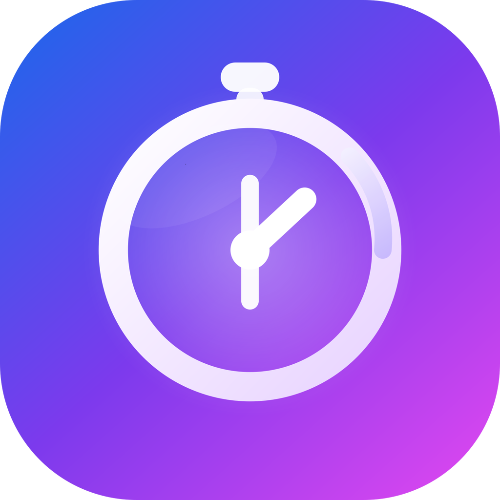

<p align="center">
  
</p>

<h1 align="center">
  ⏱️ Time Tracker
</h1>

<p align="center">
  Cronómetro y temporizador moderno enfocado en precisión, productividad y experiencia premium.
</p>

<p align="center">

  
  
  
  

</p>

---

## ✨ Overview

**Time Tracker** es una aplicación móvil de alto rendimiento diseñada para la precisión y la simplicidad.

Construida bajo una filosofía minimalista y *local-first*, permite gestionar cronómetros y temporizadores con sincronización basada en el reloj real del sistema utilizando `Date.now()`.

El proyecto forma parte de mi portafolio profesional y demuestra habilidades en:

- Arquitectura modular
- Gestión de estado global
- Persistencia nativa
- Diseño UX premium
- Optimización de rendimiento en React Native

---

# ⚡ Features

## ⏱️ Dual Mode Engine
Intercambio fluido entre:

- Stopwatch
- Countdown Timer

Con precisión basada en tiempo real.

---

## 🎯 Precisión Atómica
Motor de tiempo optimizado utilizando:

```ts
Date.now()
```

Esto evita:
- drift acumulado
- desincronización
- pérdida de precisión en background

---

## 🚩 Smart Session Tracking

- Registro ilimitado de marcas
- Historial persistente
- Métricas de eficiencia
- Comparación:
  - Tiempo Real
  - Tiempo Productivo

---

## 🎨 Premium Experience

- Interfaz minimalista
- Tipografía tabular
- Feedback háptico
- Notificaciones locales
- Cloudy Sky Theme
- Acentos dinámicos azul/magenta

---

## ⚙️ User Controls

- Toggle de milisegundos
- Keep Awake
- Gestión de presets
- Selector personalizado
- Persistencia automática

---

# 🛠️ Tech Stack

| Tecnología | Uso |
|---|---|
| React Native | Mobile Framework |
| Expo SDK 51+ | Runtime & Tooling |
| TypeScript | Static Typing |
| React Navigation | Navigation System |
| Context API | Global State |
| AsyncStorage | Local Persistence |
| Expo Haptics | Tactile Feedback |
| Expo Notifications | Local Notifications |

---

# 🚀 Getting Started

Asegúrate de tener instalado:

- Node.js
- Expo Go

---

## 1. Clone Repository

```bash
git clone https://github.com/JaiRB19/TimeTrackerApp.git
```

---

## 2. Install Dependencies

```bash
npm install
```

---

## 3. Run Development Server

```bash
npx expo start
```

---

# 🗺️ Roadmap

## 📊 Smart History & Analytics

- [ ] Gráficas semanales de productividad
- [ ] Análisis de eficiencia
- [ ] Porcentaje automático de enfoque
- [ ] Comparativa entre tiempo real y tiempo trackeado

---

## 🏷️ Session Categories

- [ ] Trabajo
- [ ] Estudio
- [ ] Deporte
- [ ] Categorías personalizadas

---

## 🧩 Widgets

- [ ] Android Home Widgets
- [ ] iOS Widgets
- [ ] Live Session Tracking

---

## 📄 Export System

- [ ] Exportación CSV
- [ ] Exportación PDF
- [ ] Reportes mensuales

---

## 🎨 Advanced UI

- [ ] React Native Reanimated
- [ ] Micro-interacciones avanzadas
- [ ] Full Dark Mode
- [ ] Dynamic Themes

---

# 🔒 Privacy First

Time Tracker adopta una filosofía:

- ✅ Local First
- ✅ Sin cuentas
- ✅ Sin tracking invasivo
- ✅ Sin servidores externos

Todos los datos permanecen en el dispositivo del usuario.

---

# 📦 Release

Consulta las novedades y cambios recientes:

- [Release Notes](https://github.com/JaiRB19/TimeTrackerApp/releases)

---

<p align="center">
  Desarrollado con precisión por
  <a href="https://github.com/JaiRB19">Jai</a>
</p>